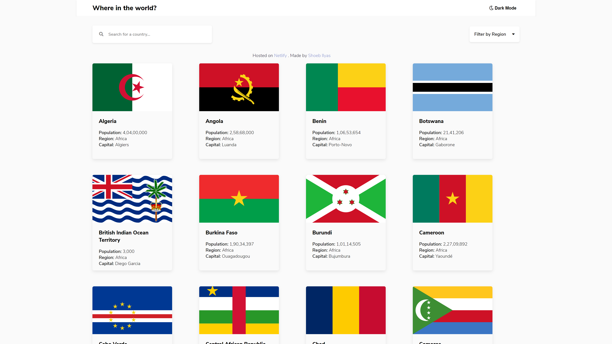
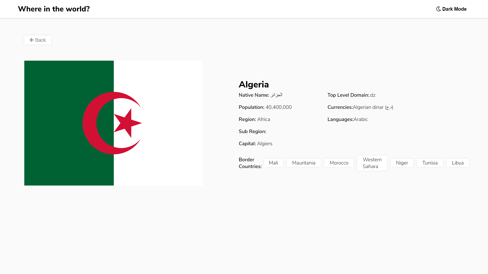
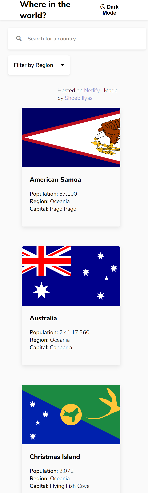
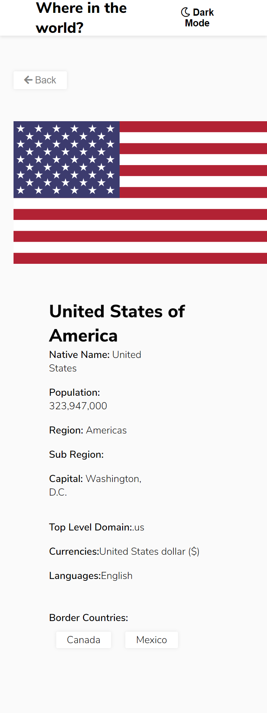

# Frontend Mentor - REST Countries API with color theme switcher solution

This is a solution to the [REST Countries API with color theme switcher challenge on Frontend Mentor](https://www.frontendmentor.io/challenges/rest-countries-api-with-color-theme-switcher-5cacc469fec04111f7b848ca). Frontend Mentor challenges help you improve your coding skills by building realistic projects.

## Table of contents

- [Overview](#overview)
  - [The challenge](#the-challenge)
  - [Screenshots](#screenshots)
  - [Links](#links)
- [My process](#my-process)
  - [Built with](#built-with)
  - [What I learned](#what-i-learned)
- [Author](#author)

## Overview

This was a very fun as well as difficulty project to make. However, it helped me improve me practice what I have learnt. Thanks to www.frontendmentor.io.

### The challenge

Users should be able to:

- See all countries from the API on the homepage
- Search for a country using an `input` field
- Filter countries by region
- Click on a country to see more detailed information on a separate page
- Click through to the border countries on the detail page
- Toggle the color scheme between light and dark mode _(optional)_

### Screenshots

-Desktop: 
-DetailsPage-Desktop: 
-Mobile: 
-DetailsPage-Mobile

- Solution URL: [Solution Link-Frontendmentor.io](https://www.frontendmentor.io/solutions/rest-countries-api-with-color-theme-switcher-p086P7jgh)
- Live Site URL: [Live Site!](https://shoebilyas-restcountries.netlify.app/)

## My Process

### Built with

- Semantic HTML5 markup
- CSS custom properties
- Flexbox
- CSS Grid
- Vanilla JavaScript

### What I learned

I had recently learnt about fetch and ajax calls. With the help of this project, I was able to retain these concepts and implement them properly

## Author

- Website - [ShoebIlyas-LinkedIn](https://www.linkedin.com/in/shoeb-ilyas-6754aa1b6/)
- Frontend Mentor - [@shoebilyas123](https://www.frontendmentor.io/profile/shoebilyas123)
- Twitter - [@shoebilyas3](https://www.twitter.com/shoebilyas3)
